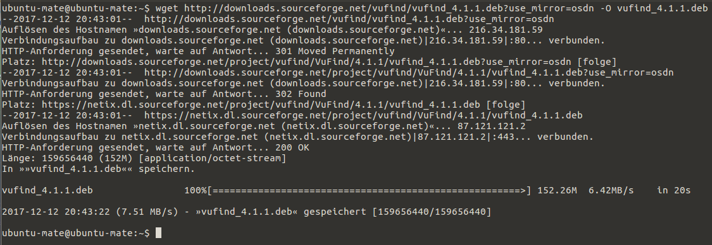
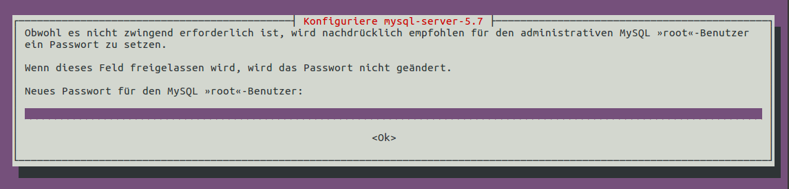
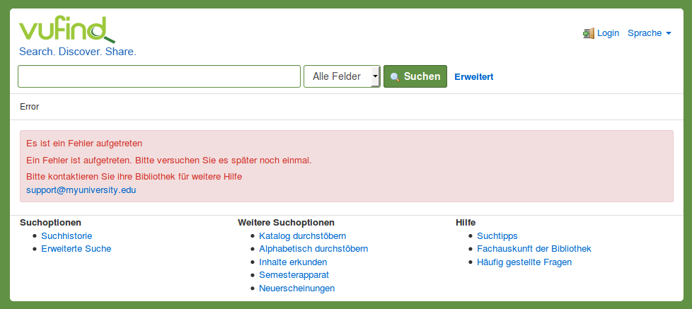
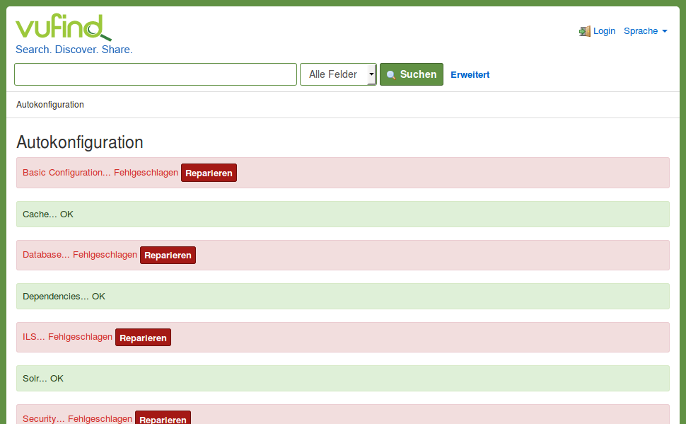
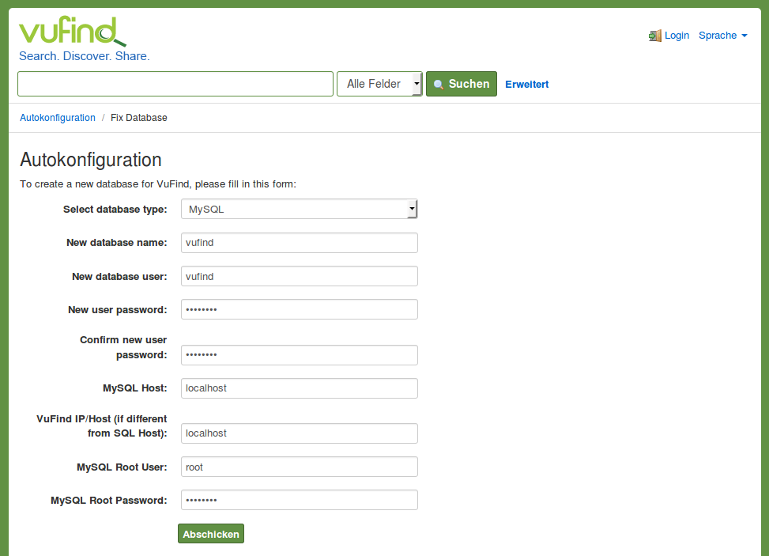
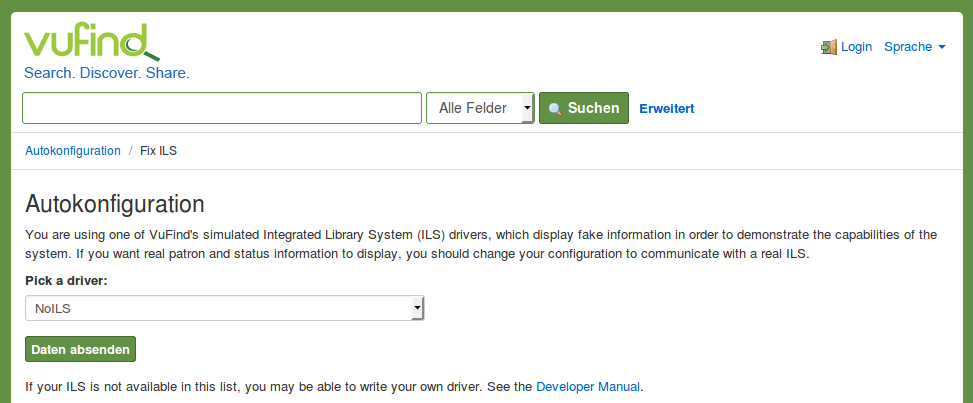
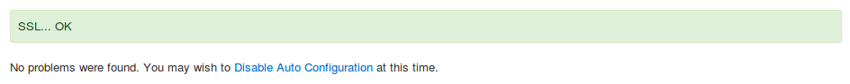

# Installation von VuFind

In den vorigen beiden Kapiteln haben Sie ein Ubuntu-Linux-Betriebssystem (16.04 LTS) in VirtualBox installiert. In diesem Kapitel installieren wir nun VuFind und die dafür benötigten Softwarekomponenten. Dazu gehören:

* Webserver (Apache)
* Suchindex (Solr)
* Programmiersprache (PHP)
* Datenbank (MySQL)

## Aktualisierung des Betriebssystems

Vor der Installation sollte das Betriebssystem auf den aktuellsten Stand gebracht werden. Führen Sie dazu folgenden Befehl im Terminal aus:

```bash
sudo apt-get update && sudo apt-get dist-upgrade
```

Der Installation der Updates müssen Sie mit der Antwort „J“ auf die Frage „Möchten Sie fortfahren? \[J/n\]“ zustimmen.

Anschließend sollte das System neu gestartet werden:

```bash
sudo shutdown -r now
```

## Download des Installationspaketes

Führen Sie im Terminal folgenden Befehl aus:

```bash
wget http://downloads.sourceforge.net/vufind/vufind_4.1.1.deb?use_mirror=osdn -O ~/vufind_4.1.1.deb
```

Die Installationsdatei (ein sogenanntes Paket) wird in Ihr Homeverzeichnis heruntergeladen:



## Installation des Paketes

Führen Sie im Terminal folgenden Befehl aus:

```bash
sudo apt install -f ~/vufind_4.1.1.deb
```

Dieser Befehl installiert VuFind und alle für VuFind benötigten Pakete (sogenannte abhängige Pakete). Bei diesen Paketen handelt es sich um die in der Einleitung beschriebenen Softwarekomponenten (Apache, Solr, MySQL, PHP).

Der Installation müssen Sie mit der Antwort „J“ auf die Frage „Möchten Sie fortfahren? \[J/n\]“ zustimmen.

Für die Installation von MySQL wird die Angabe eines Root-Kennwortes erfragt:



Notieren Sie sich das Kennwort, da es für die spätere Konfiguration von VuFind benötigt wird. Es erscheint ein weiteres Fenster, in welchem Sie die Eingabe des Kennworts wiederholen müssen. Danach wird die Installation fortgesetzt. 

Wenn die Installation abgeschlossen ist, starten Sie den Firefox Browser. Rufen Sie die Webseite <http://localhost/vufind> auf. Nach kurzer Zeit erscheint die Startseite von VuFind:



Der Hinweis „Es ist ein Fehler aufgetreten“ erscheint, weil die Suchmaschine Solr noch nicht gestartet wurde.

## Berechtigungen setzen und Solr starten

Führen Sie im Terminal folgenden Befehl aus:

```bash
source /etc/profile
```

Durch diesen Befehl werden die Umgebungsvariablen neu eingelesen, was uns einen Neustart erspart. Die Umgebungsvariablen werden zum Betrieb von VuFind benötigt und enthalten den Pfad zur Java-Instanz, zum Hauptverzeichnis von VuFind sowie zum Verzeichnis mit Ihren lokalen Einstellungen für VuFind.

Geben Sie folgende Befehle ein, um notwendige Berechtigungen für Solr und VuFind zu konfigurieren:

```bash
sudo chown -R $(id -u):$(id -g) /usr/local/vufind/
sudo chown -R www-data:www-data /usr/local/vufind/local/config
sudo chown -R www-data:www-data /usr/local/vufind/local/cache
```

Der erste Befehl setzt den aktuell angemeldeten Nutzer als Eigentümer des Verzeichnisses `/usr/local/vufind`. Damit der Apache-Webserver auf bestimmte Verzeichnisse zugreifen kann, wird für die Unterordner `local/config` und `local/cache` der Nutzer `www-data` als Eigentümer gesetzt.

Starten Sie dann den Suchindex Solr:

```bash
/usr/local/vufind/solr.sh start
```

Wenn Sie die noch im Firefox geöffnete Startseite von VuFind aktualisieren, wird der Fehlerhinweis nicht mehr angezeigt:


## Automatische Konfiguration

Öffnen Sie jetzt die Seite <http://localhost/vufind/Install/Home>. Angezeigt wird die Autokonfiguration von VuFind:



### Grundkonfiguration

Klicken Sie den Schalter „Reparieren“ hinter „Basic Configuration“ an. Dies wird quittiert mit „Your configuration has been successfully updated.“ Wechseln Sie über den Link "Autokonfiguration" wieder zurück auf die vorige Seite.

### Datenbank

Beim Reparieren von „Database“ erscheint eine Eingabemaske:



Geben Sie in das Feld „New user password“ ein Kennwort ein. Wiederholen Sie dieses Kennwort im Feld „Confirm new user password“. Notieren Sie sich das Kennwort.
Geben Sie im Feld „MySQL Root Password“ das während der VuFind-Installation vergebene Root-Kennwort für MySQL.
Klicken Sie anschließend „Abschicken“ an.

## Anbindung Bibliothekssystem

Beim Reparieren von „ILS“ erscheint ebenfalls eine Eingabemaske:



Wählen Sie „NoILS“ aus der Liste aus. Klicken Sie anschließend „Daten absenden“ an.

---------

**!!!** Alternativ können Sie Ihr Lokalsystem aus der Liste wählen und es konfigurieren. Beachten Sie jedoch, dass dies nicht Bestandteil dieses Tutorials ist.

---------

Zurück auf der Konfigurationsseite erhalten wir weiterhin die Fehlermeldung "ILS... Fehlgeschlagen". Die Autokonfiguration hat die Einstellung auf NoILS mit der Option „ils-offline“ gesetzt, die für Wartungsarbeiten gedacht ist. Wir müssen diese noch auf „ils-none“ setzen, um VuFind zu signalisieren, dass tatsächlich kein Lokalsystem angebunden ist. Diese Einstellung ist in der Datei `/usr/local/vufind/local/config/vufind/NoILS.ini` vorzunehmen. Geben Sie dazu im Terminal folgenden Befehl ein:

```bash
sudo sed -i 's/mode = ils-offline/mode = ils-none/g' /usr/local/vufind/local/config/vufind/NoILS.ini
```

Wenn Sie anschließend die Seite Autokonfiguration neu laden, wird "ILS... OK" angezeigt.

### Sicherheitseinstellungen

Klicken Sie abschließend den Schalter „Reparieren“ im Bereich „Security“ an.

Unterhalb der Statusmeldungen erscheint nun ein Link zum Abschalten der Autokonfiguration:



Klicken Sie „Disable Auto Configuration“ an.

Dies wird mit „Auto configuration has been successfully disabled.“ und der Empfehlung quittiert, die Berechtigungen für das Konfigurationsverzeichnis sicherheitshalber anzupassen. Geben Sie dazu noch den folgenden Befehl ins Terminal ein:

```bash
sudo chown -R $(id -u):$(id -g) /usr/local/vufind/local/config
```

Dieser Befehl sorgt dafür, dass Ihr Benutzer zum Besitzer des Verzeichnisses `/usr/local/vufind/local/config` wird und dieses nicht mehr durch den Webserver verändert werden kann. Das Verzeichnis enthält die lokale Konfiguration für VuFind (mehr dazu in den folgenden Kapiteln).

## Zwischenstand

Die automatische Konfiguration von VuFind ist damit abgeschlossen und das System einsatzbereit.

Im nächsten Schritt importieren wir Testdaten, denn momentan ist der Suchindex noch komplett leer.

## Sicherungspunkt in VirtualBox setzen

Fahren Sie nun das Betriebssystem herunter und setzen Sie in VirtualBox einen Sicherungspunkt namens „VuFind, bereit für Testimport“.

## Quellen

VuFind Dokumentation: Installation Notes (Stand: 20.11.2017)
<https://vufind.org/wiki/installation:notes>

VuFind Dokumentation: Local Settings Directory (Stand 21.12.2015)
<https://vufind.org/wiki/configuration:local_settings_directory>

VuFind on Ubuntu. VuFind Documentation (Stand 20.11.2017)
<https://vufind.org/wiki/installation:ubuntu>
