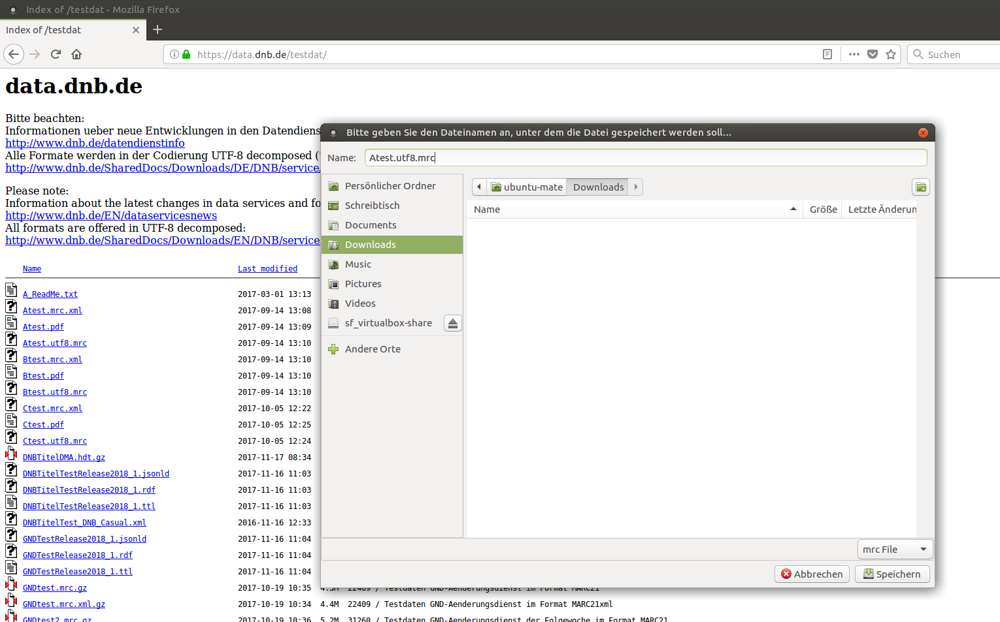
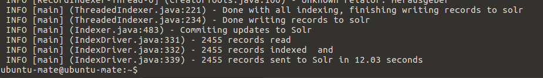

# Durchführung eines Testimports

Um VuFind und seine Funktionen erstmalig in Augenschein zu nehmen, empfiehlt sich die Durchführung eines Testimports. Dabei laden Sie Testdaten in den Suchindex von VuFind und lernen somit bereits, wie Sie einen ersten einfachen Datenimport durchführen. Gut geeignet für einen Testimport sind Testdaten der Deutschen Nationalbibliothek (DNB).

## Download von Testdaten

Öffnen Sie das Verzeichnis Testdaten auf dem Downloadserver data.dnb.de der Deutschen Nationalbibliothek:
<https://data.dnb.de/testdat/>

Laden Sie die Datei ```Atest.utf8.mrc``` in das Verzeichnis ```Downloads ``` Ihres Homeverzeichnisses herunter (Rechtsklick auf den Dateinamen und "Ziel speichern unter..." wählen).



## Start von Solr

Starten Sie die Suchmaschine Solr im Terminal (erforderlich nach jedem Neustart):

```
/usr/local/vufind/solr.sh start
```

## Anpassung der Einstellungen für den Import

Öffnen Sie die Datei `marc_local.properties ` im Verzeichnis `/usr/local/vufind/import/` mit einem Texteditor und editieren Sie die drei Werte `collection`, `institution` und `building` wie folgt:


Achten Sie darauf, dass Sie jeweils das führende `#`-Zeichen entfernen. Speichern Sie die Änderungen.

## Starten des Importes

Starten Sie den Import:

```
/usr/local/vufind/import-marc.sh ~/Downloads/Atest.utf8.mrc
```

Während des Importes werden diverse Statusmeldungen ausgegeben. Zum Abschluss meldet der Import unter anderem, wie viele Datensätze er dem Index hinzugefügt hat:



## Suche in VuFind

Öffnen Sie VuFind in Firefox und starten Sie eine leere Suche, indem Sie den Suchschlitz leer lassen und einfach „Suchen“ anklicken.


Sie können unter anderem erkennen, dass alle 2.455 importierten Datensätze mit der leeren Suche gefunden wurden. Außerdem wird die Suchdauer angegeben (hier: 0,48s).

Die Suchdauer lässt sich verkürzen, indem Sie den Index optimieren. Außerdem werden Suchanfragen automatisch in einen Cache geladen, so dass eine erneute identische Suche schneller erfolgt.

## Index optimieren

Führen Sie im Terminal folgenden Befehl aus:

```
php /usr/local/vufind/util/optimize.php
```

Die Optimierung läuft ohne Anzeigen im Terminal ab und ist beendet, wenn wieder ein Cursor im Terminal erscheint.

Durch die Optimierung des Suchindex werden die Suchen in VuFind jetzt geringfügig schneller erfolgen. In der Dokumentation wird empfohlen, nach jeder Indexierung von neuen Daten den Suchindex zu optimieren.

## Sicherungspunkt in VirtualBox setzen

Fahren Sie das Betriebssystem herunter und setzen Sie in VirtualBox einen weiteren Sicherungspunkt namens „mit Testimport“.

## Weitere Informationen zum Datenimport

Beim Datenimport werden die einzelnen Felder eines Datensatzes einem Indexfeld im Solr-Index zugeordnet. Dies kann mit Hilfe von Einstellungsdateien wie der oben verwendeten ```marc_local.properties``` beeinflusst werden. Die Einstellungen steuern, welche Felder aus den zu importierenden Daten in welches Indexfeld im Solr-Index importiert werden.

Direkt in VuFind importieren können Sie Daten in den Formaten:

* MARC21 (binäres MARC)
* MARCXML
* XML

Für den Import von Daten in XML-Formaten sind größere Anpassungen erforderlich. Dies betrifft ebenfalls das Harvesting von Daten über OAI-PMH. Innerhalb des Tutorials werden wir uns ausschließlich mit dem Datenimport in den beiden MARC-Formaten beschäftigen.

## Quellen

VuFind Dokumentation: Performance (Stand 11.8.2017)
<https://vufind.org/wiki/administration:performance>

VuFind Dokumentation: Indexing (Stand: 21.4.2017)
<https://vufind.org/wiki/indexing>