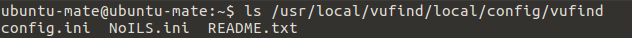
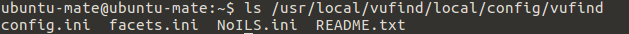

# Überblick zur Konfiguration

Diese Themen werden wir in den Kapiteln zur Konfiguration von VuFind behandeln:

* Allgemeine Einstellungen
* Anpassung der Katalogoberfläche
* Konfiguration der Facetten
* Konfiguration von Kataloganreicherungen
* Konfiguration der Suche

Weitere Möglichkeiten zur Konfiguration werden in der [VuFind-Dokumentation](https://vufind.org/wiki/configuration) beschrieben.

Bevor wir uns mit der eigentlichen Konfiguration beschäftigen, ist eine kurze Vorbereitung notwendig.

## Vorbereitung der Konfiguration

Für die Konfigurationsdateien von VuFind gibt es ein globales und ein lokales Verzeichnis:

* Das globale Konfigurationsverzeichnis befindet sich unter dem Pfad `/usr/local/vufind/config/vufind`
* Das lokale Konfigurationsverzeichnis befindet sich unter dem Pfad `/usr/local/vufind/local/config/vufind`

Befindet sich eine Konfigurationsdatei auch im lokalen Verzeichnis, so überschreiben die dort enthaltenen Informationen die globalen Einstellungen. Es wird empfohlen, Konfigurationsänderungen ausschließlich im lokalen Konfigurationsverzeichnis vorzunehmen. Dazu müssen ggf. Konfigurationsdateien, in denen Sie Veränderungen vornehmen möchten, zunächst in das lokale Verzeichnis kopiert werden.

Während des Tutorials werden wir mit den Dateien `config.ini` und `facets.ini` arbeiten. Die Datei `config.ini` ist die zentrale Konfigurationsdatei von VuFind. Die Datei `facets.ini` enthält Einstellungen zu den Facetten.

Lassen Sie sich die Inhalte des lokalen Konfigurationsverzeichnisses im Terminal anzeigen:

```
ls /usr/local/vufind/local/config/vufind
```



Die Dateien `config.ini` und `NoILS.ini`wurden während der Installation beim Schritt „Autokonfiguration“ angelegt. Für unser Tutorial fehlt noch die Datei `facets.ini`.

Kopieren Sie die Datei ```facets.ini```aus dem globalen Konfigurationsverzeichnis in das lokale Konfigurationsverzeichnis mit folgendem Befehl:

```
cp /usr/local/vufind/config/vufind/facets.ini /usr/local/vufind/local/config/vufind
```

Wenn Sie sich die Inhalte des lokalen Konfigurationsverzeichnisses erneut anzeigen lassen, sollte jetzt die Datei `facets.ini` enthalten sein.



## Quellen

VuFind Dokumentation: Local Settings Directory (Stand 21.12.2015)
<https://vufind.org/wiki/configuration:local_settings_directory>