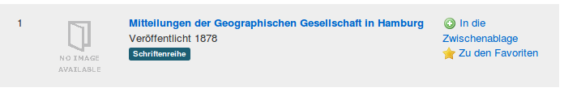
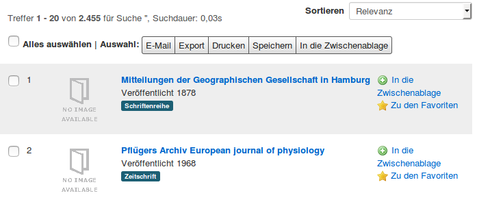
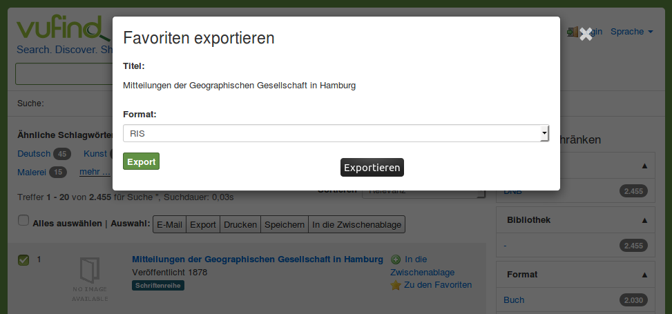

# Allgemeine Einstellungen

Die allgemeinen Einstellungen von VuFind sind in der Datei ` config.ini` untergebracht. Die Konfigurationsdatei enthält selbst viele Kommentare, welche die Einstellungsmöglichkeiten erläutern. Die Datei ist in Abschnitte eingeteilt, deren Namen jeweils mit eckigen Klammern markiert sind.

Im Folgenden werden einige allgemeine Einstellungen kurz näher vorgestellt. Um diese Einstellungen durchzuführen, müssen Sie die `config.ini` mit einem Text Editor bearbeiten.

Konfigurationsänderungen werden sofort im Katalog wirksam (Konfigurationsdatei speichern, Webseite neu laden).

## E-Mail und Titel

Diese Einstellungen finden sich im Abschnitt `[Site]`. Beispiel:

```
email = stefan.niesner@smail.fh-koeln.de
title = "MALIS14"
```

## Sprache, Zeitzone und Datumsformat

```
language = de
locale = de_DE
timezone = "Europe/Berlin"
displayDateFormat = "d-m-Y"
```

## Merkliste

Um die Merklisten-Funktion zu aktivieren:

```
showBookBag = true
```

Ist die Merkliste aktiviert, erscheint diese unter anderem als Option "In die Zwischenablage" neben den Suchtreffern.



In der mitgelieferten deutschen Übersetzung wurde die Funktionalität der Merkliste mit “Zwischenablage” übersetzt. Im weiteren Verlauf dieser Anleitung wird erklärt, wie Sie Übersetzungen anpassen können.

## Mehrfachauswahl

Option zur Mehrfachauswahl von Treffern (Checkbox bei jedem Suchtreffer und Buttons zum Drucken, Speichern usw.) aktivieren:

```
showBulkOptions = true
```



## Exportformate

Die Exportformate werden im Abschnitt `[Export]` eingeschaltet oder ausgeschaltet. In der Werkseinstellung sind RefWorks, EndNote und EndNoteWeb aktiviert. MARC, MARCXML, RDF, BibTeX und RIS (Research Information System Format) sind deaktiviert:

Um zum Beispiel RIS als einziges Exportformat anzubieten müssen Sie folgende Einstellungen vornehmen:

```
RefWorks = false
EndNote = false
EndNoteWeb = false
MARC = false
MARCXML = false
RDF = false
BibTeX = false
RIS = "record,bulk"
```



## Navigation innerhalb der Einzeltreffer

In der Werkseinstellung wird ein Einzeltreffer so angezeigt, dass keine Navigation zum vorherigen oder nächsten Treffer aus der Trefferliste möglich ist:

Um diese Navigation einzuschalten, aktivieren Sie die folgende Einstellung innerhalb des Abschnitts `[Record]`:

```
next_prev_navigation = true
```


## Übersetzungen

Die Übersetzungen für Elemente von VuFind werden über Dateien im Verzeichnis `languages` gesteuert. Die Datei für Deutsch ist `de.ini`. Die Standardsprachdatei für die deutsche Übersetzung liegt also im Pfad `/usr/local/vufind/languages/de.ini`

Innerhalb der Datei steht jede Zeile für eine Übersetzung in der Form

```
Book Bag = "Zwischenablage"
```

Die Übersetzung hinter dem Gleichzeichen muss in Anführungszeichen stehen.

Um Übersetzungen anzupassen, sollten Sie ebenso wie bei der übrigen Konfiguration Änderungen im Verzeichnis `local` vornehmen. Innerhalb von VuFind werden die Einstellungen für die Übersetzungen vererbt. Einträge für eine Sprache im lokalen Sprachverzeichnis erhalten dabei den Vorrang gegenüber Einträgen in der Standardsprachdatei. Bei Übersetzungen ist keine vollständige Kopie der Standardsprachdatei notwendig. Es reicht aus, wenn Sie Ihre Änderungen in eine neue Datei schreiben. Erstellen Sie dazu mit folgenden Befehlen im Terminal den Ordner `languages` und die Datei `de.ini`:

```
mkdir /usr/local/vufind/local/languages
touch /usr/local/vufind/local/languages/de.ini
```

Um eine bestimmte Übersetzung anzupassen, identifizieren Sie diese zuerst in der Standardsprachdatei. Dann kopieren Sie diese Einträge in Ihre lokale Sprachdatei und passen die Übersetzung wie gewünscht an.

Wie weiter oben im Abschnitt „Merkliste“ angemerkt, ändern wir nun den Begriff „Zwischenablage“ in „Merkliste“.

Fügen Sie dazu mit einem Texteditor die folgenden Zeilen in Ihre Sprachdatei `/usr/local/vufind/local/languages/de.ini` ein:

```
Add to Book Bag = "In die Merkliste"
Book Bag = "Merkliste"
bookbag_confirm_empty = "Wollen Sie ihre Merkliste wirklich leeren?"
bookbag_delete = "Auswahl aus der Merkliste löschen"
bookbag_email = "Auswahl der Merkliste per E-Mail versenden"
bookbag_export = "Auswahl der Merkliste exportieren"
bookbag_full_msg = "Ihre Merkliste ist voll"
bookbag_is_empty = "Ihre Merkliste ist leer"
bookbag_save = "Auswahl der Merkliste speichern"
Empty Book Bag = "Merkliste leeren"
items_added_to_bookbag = "Auswahl wurde der Merkliste hinzugefügt"
items_already_in_bookbag = "Auswahl ist bereits in der Merkliste vorhanden"
Remove from Book Bag = "Aus der Merkliste entfernen"
View Book Bag = "Merkliste ansehen"
Your book bag is empty = "Ihre Merkliste ist leer"
```

---------

 **!!!** Achten Sie unbedingt darauf, dass alle Zeilen in der Datei alphabetisch sortiert sind.

--------- 

Damit die Änderungen wirksam werden, müssen wir noch den Cache für die Sprachinformationen leeren. Führen Sie dazu diesen Befehl im Terminal aus:

```
sudo rm -rf /usr/local/vufind/local/cache/languages
```

Anschließend werden die angepassten Übersetzungen in VuFind angezeigt.

## Quellen

VuFind Dokumentation: Language Support (Stand 31.05.2016)
<https://vufind.org/wiki/development:architecture:localization>