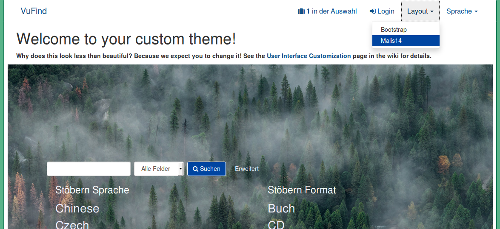
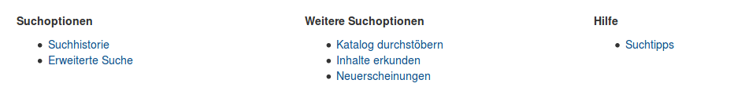
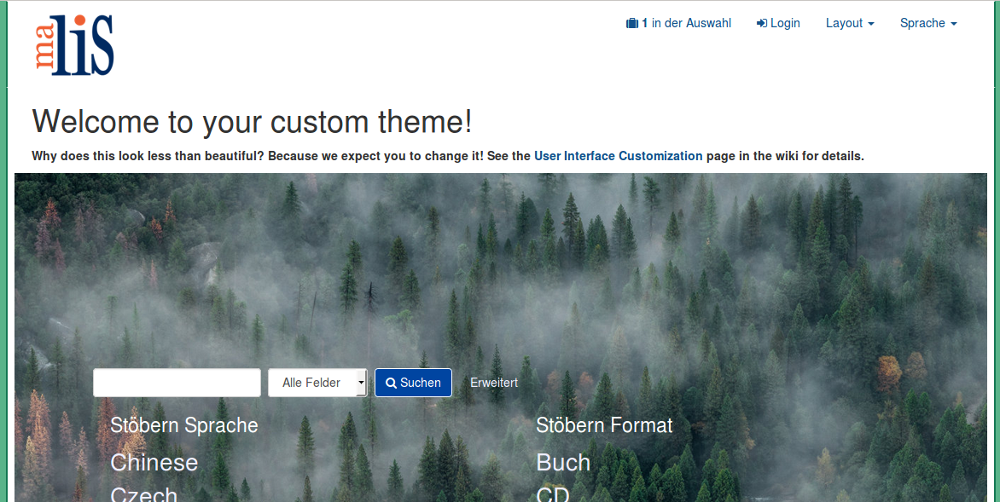

# Anpassung der Katalogoberfläche

Die Gestaltung der Katalogoberfläche basiert auf sogenannten Templates. Es gibt HTML-Templates für den Aufbau einer Seite und CSS-Templates für das Layout. Die HTML-Templates enthalten außerdem Programmcode in der Skriptsprache PHP, in welcher die Webseiten von VuFind programmiert sind. Alle Templates zusammen werden als Theme bezeichnet.

In diesem Kapitel werden wir ein eigenes Theme anlegen, den Footer von VuFind anpassen und das VuFind-Logo gegen ein eigenes Logo austauschen. Diese Schritte sollen Ihnen exemplarisch ein Grundverständnis für die Anpassung von Themes in VuFind geben.

## Eigenes Theme erstellen

Mit Version 4.1 bietet VuFind ein Kommandozeilen-Tool, um ein neues Theme zu erstellen. Das letzte Wort im folgenden Befehl definiert den Namen für das neue Theme (hier werden wir `malis14` verwenden).

```
php /usr/local/vufind/public/index.php generate theme malis14
```

Die Dateien für das neue Theme liegen anschließend im Ordner `/usr/local/vufind/themes/malis14`. Die lokale Konfigurationsdatei `/usr/local/vufind/local/config/vufind/config.ini` wurde automatisch angepasst. Sie können nun über die Webseite in einem neuen Menüpunkt `Layout` zwischen dem Standard-Theme (Bootstrap) und dem neuen Theme umschalten.



## Anpassung des Footers

Kopieren Sie mit dem folgenden Befehl die Template-Datei `footer.phtml` aus dem Standard-Theme (`/usr/local/vufind/themes/bootstrap3/templates/`) in das Verzeichnis `templates` Ihres Themes.

```
cp /usr/local/vufind/themes/bootstrap3/templates/footer.phtml /usr/local/vufind/themes/malis14/templates/
```

Öffnen Sie anschließend die Datei mit einem Text Editor, löschen Sie die folgenden Zeilen und speichern Sie die Datei:

* `<li><a href="<?=$this->url('alphabrowse-home')?>"><?=$this->transEsc('Browse Alphabetically')?></a></li>`
* `<li><a href="<?=$this->url('search-reserves')?>"><?=$this->transEsc('Course Reserves')?></a></li>`
* `<li><a href="<?=$this->url('content-page', ['page' => 'asklibrary']) ?>"><?=$this->transEsc('Ask a Librarian')?></a></li>`
* `<li><a href="<?=$this->url('content-page', ['page' => 'faq']) ?>"><?=$this->transEsc('FAQs')?></a></li>`

Durch die Löschungen wurde die Möglichkeit zum Aufruf der Funktionen „Alphabetisch durchstöbern“ (Browse Alphabetically), Semesterapparat (Course Reserves), „Fachauskunft der Bibliothek“ (Ask a Librarian) und „Häufig gestellte Fragen“ (FAQs) auf der Startseite von VuFind entfernt. Diese Funktionen werden wir innerhalb des Tutorials nicht konfigurieren.

Die Änderung wird sofort auf der Webseite sichtbar:



## Änderung des Logos über dem Suchschlitz

Legen Sie im Verzeichnis `/usr/local/vufind/themes/malis14` das gewünschte Logo ab. Wenn Sie kein eigenes Logo parat haben, können Sie das hier verwendete  `malis.png` herunterladen:

```
wget https://raw.githubusercontent.com/felixlohmeier/vufindtutorialde/master/media/07/malis.png -O /usr/local/vufind/themes/malis14/images/malis.png
```

Stellen Sie mit folgendem Befehl sicher, dass das Logo vom Webserver gelesen werden kann:
```
chmod +r /usr/local/vufind/themes/malis14/images/malis.png
```

Öffnen Sie nun im Verzeichnis `/usr/local/vufind/themes/malis14/less` die Datei `custom.less` mit einem Text Editor.

1. Ersetzen Sie `@image-path: "../../local_theme_example/images";` durch `@image-path: "../../images";`
2. Ersetzen Sie den Abschnitt `header` wie folgt:

```
header {
  .navbar {
    .navbar-brand {
      background-image:url('../../images/malis.png');
      color:transparent;
      height:100px;
      width:100px;
      &:hover,&:active,&:focus { color:transparent; }
    }
  }
}
```

Unter `background-image` tragen Sie den Pfad Ihres Bildes ein. Die Angaben bei `height` und `width` müssen den tatsächlichen Abmessungen Ihres Bildes in Pixeln entsprechen. Das hier verwendete Bild ist 100 Pixel hoch und 100 Pixel breit.

Führen Sie abschließend den folgenden Befehl im Terminal aus, um die veränderte Konfiguration zu aktivieren:

```
php /usr/local/vufind/util/cssBuilder.php
```

Der Befehl baut aus den Dateien im Verzeichnis `less` jedes(!) Themes eine neue Datei namens `compiled.css` im Unterverzeichnis `css` zusammen.

Wenn Sie anschließend in Firefox die VuFind-Startseite neu aufrufen, wird oben links das verwendete Logo angezeigt.



## Quellen

VuFind Dokumentation: User Interface Customization (Stand 18.10.2017)
<https://vufind.org/wiki/development:architecture:localization>

VuFind Dokumentation: LESS / SASS (Stand 2.8.2017)
<https://vufind.org/wiki/development:architecture:less>
